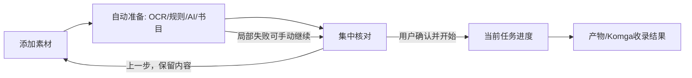

# Design — 单工作区处理向导

状态：review；已实施并完成验收，自动准备后保留一次最终确认。

## Architecture and flow

沿用原生JS/htmx/Go模板/Vite。home负责步骤与唯一工作区，OCR/书目/共享metadata draft维持各自职责；步骤不是后端Task Core状态。

自动准备为短暂状态屏；默认使用已配置AI/来源，入口可见地说明发送范围并允许关闭，不逐引擎弹确认。自动准备成功停在核对页，用户集中检查作品信息、来源和交付目标，点击一次“确认并开始”。无冲突也不自动提交。旧OCR O8/书目P2的逐次手动触发条款按该决定同步，管理员和一致性边界保留。

## Navigation and state

- workflow仅保存step、输入generation、各阶段完成指纹、活动请求及task ID；字段值继续归共享draft。
- 步骤内前后移动不unmount。步骤保存在内存，不把图文或步骤草稿写入浏览器history；离开工作区仍执行取消/清理，刷新不恢复图文。
- 自动推进须当前step仍等待该操作且generation未变。用户返回使推进资格失效；迟到结果不得抢焦点。
- 输入变化失效对应结果，保留人工字段。请求取消与迟到结果校验并用；未变输入不重复OCR/AI/搜索。
- 最终确认前只能准备识别/候选和本地来源引用；会创建任务的upload init、下载、Komga写操作均在确认后执行。确认时固定document/input/config版本、来源与目标；提交preflight发现改变则返回核对，不沿用旧确认。提交中锁住该快照的编辑，返回仍保留内容。
- 提交固定草稿/配置版本和目标。当前服务端创建UUID，上传init响应丢失时客户端可能没有task ID；应补稳定创建幂等键和受管理员保护的结果回查，再使用同一键恢复，不能只靠按钮禁用或未知task ID查询。提交后OCR clean标志随成功快照更新，避免错误离页警告。

## Recognition and evidence

保留raw图文，有限归一化产生派生文本和offset→原图/原文映射。裁剪实验只证明去噪，字形精度不保证提高；是否新增反色/放大由合成基准决定。需要分区坐标时才扩展recognizer，避免先引入多引擎。

caption有限模式识别作者/标题/翻译，不把所有方括号当作者。完整caption优先；角色补充不塞series。摘要按区域/段落结束，CJK内部空白与标签别名分别处理。保留英文姓名空格及正文合法数字、括号。

AI字段说明应解释角色，默认常用六字段需实测预算与时延。文字支持不等于语义正确；保留grounding，不能用放宽校验换通过。本轮六字段提取返回unavailable，原因未确立，是后续识别可靠性验收项。

## Candidate coordination

按字段聚合当前值、建议值、来源、证据及冲突。相同值合并证据；空值/无冲突/未手改/证据直接的值可预填。人工锁/clear及不同值集中呈现具体差异；在核对稿内修改，无需额外逐候选采用页或采用按钮。未解决冲突阻止最终提交并定位字段。

复用schema/type/version/preflight/atomic apply，不让OCR直接修改字段。模型自报置信度不作自动覆盖依据。启用来源默认集合，标题/别名有限检索；零命中可继续，同名不同作者/分卷不自动首选。

## Task result and Komga

复用submission/logs资格判断，按钮文案表达真实去向。沿用保存的交付默认值，在最终摘要可见。copy与scan/readback分阶段；实现前追踪已有Komga允许库/客户端/扫描能力，缺少契约才补最小应用层编排及幂等状态。不得前端操作挂载或用copy响应冒充收录；失败从该阶段续跑，不重生成作品。

## Compatibility, rollout and rollback

CLI复用识别/规则/draft纯逻辑，向导不是强制CLI交互。保留Telegraph/上传与Telegram设置导航、原API、人工保护及401清理。无新增持久私密草稿、URL图文、原图上云或密钥日志。

先实现向导/合成回归，再候选默认，最后结果闭环；隔离样例验证外部副作用，保存既有设置。撤回仅影响新会话，已提交任务由原Task Core继续。发布不属于本轮；不引入长期双实现。
