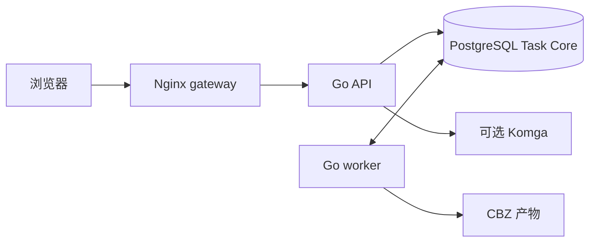

# Telegraph Downloader

**漫画下载与元数据工作台。** 从 Telegraph 页面或已有压缩包生成 CBZ，用介绍截图和公开书目资料补全作品信息，也可以编辑 Komga 中已有 CBZ 的 ComicInfo。

[](https://github.com/srcheng17/telegram_downloader/actions/workflows/ci.yml)
[](https://github.com/srcheng17/telegram_downloader/pkgs/container/telegram_downloader)

[快速启动](#快速启动) · [主要功能](#主要功能) · [使用流程](#使用流程) · [命令行与-ai](#命令行与-ai) · [更新与备份](#更新与备份) · [开发](#开发) · [文档](#文档)

## 主要功能

| 功能 | 可以做什么 |
| --- | --- |
| 下载与上传 | 提交 Telegraph 链接，或上传 ZIP / CBZ / RAR / 7Z，生成包含作品信息的 CBZ。 |
| 多图截图识别 | 粘贴或选择同一作品的多张介绍截图，本地 OCR 后合并文字；支持校对、调整顺序和单图重试。 |
| 信息采集 | 用可配置规则或可选 AI 生成字段候选；从 MangaBaka、MangaUpdates、Bangumi 搜索并逐项采用资料。 |
| 可扩展元数据 | 编辑标题、系列、编号、创作者、出版、语言、日期、标签等字段，也可注册自定义字段；保存版本化快照和明确清空状态。 |
| 任务管理 | 查看进度、筛选任务、取消与重试；完成后下载产物，或复制到配置的 Komga 目录。 |
| Komga 作品库 | 浏览允许的书库，预览改动后写回现有 CBZ 的 `ComicInfo.xml`；提供原件备份、同步状态、重试与显式恢复。 |
| 网页与命令行 | 中文界面、可隐藏侧栏、分 Tab 设置；`mediactl` 与项目 AI Skill 通过同一组管理员 API 操作。 |

截图 OCR 支持简体中文、繁体中文、日语和英语，在浏览器本地执行。AI 是可选步骤，只发送经用户确认的文字，图片不发送给 AI。标准映射字段写入固定 ComicInfo 2.1 draft profile；自定义字段当前保存在应用及私密副本中，不作为任意 XML 扩展写入 CBZ。

## 快速启动

直接使用已发布的 **`ghcr.io/srcheng17/telegram_downloader:latest`**，支持 `linux/amd64` 和 `linux/arm64`。部署需要 Docker、Docker Compose **2.24.4 或更新版本**、curl 和 Python 3。

### 1. 下载部署配置

在全新部署目录下载 Compose、环境变量示例和 Nginx 配置：

```bash
mkdir -p telegraph-downloader/deploy/nginx
cd telegraph-downloader
telegraph_config_url=https://raw.githubusercontent.com/srcheng17/telegram_downloader/main
curl -fsSL "$telegraph_config_url/docker-compose.yml" -o docker-compose.yml
curl -fsSL "$telegraph_config_url/docker-compose.image.yml" -o docker-compose.image.yml
curl -fsSL "$telegraph_config_url/.env.example" -o .env
curl -fsSL "$telegraph_config_url/deploy/nginx/canary-go-full.conf" -o deploy/nginx/canary-go-full.conf
cat >> .env <<'EOF'

COMPOSE_FILE=docker-compose.yml:docker-compose.image.yml
TELEGRAPH_IMAGE=ghcr.io/srcheng17/telegram_downloader:latest
KOMGA_LIBRARY_ROOT_HOST=./komga-library
EOF
```

`COMPOSE_FILE` 让后续 `docker compose` 命令自动加载镜像配置。API、worker 和前端资源均来自发布镜像，不需要下载源码或在本机编译。

编辑 `.env`，至少完成以下配置：

| 配置 | 首次启动要求 |
| --- | --- |
| `INTERNAL_ENQUEUE_TOKEN` | 替换示例值，使用随机令牌；它不替代管理员登录。 |
| `POSTGRES_PASSWORD` | 替换示例密码。可用 `openssl rand -hex 32` 生成此密码和令牌，分别生成、分别保存。 |
| `APP_PUBLIC_ORIGIN` | 与浏览器访问地址完全一致，包括协议和端口。 |
| `APP_UID` / `APP_GID` | 首次部署可保持 `10001:10001`，以下目录准备命令按此值执行。 |
| `KOMGA_LIBRARY_ROOT_HOST` | 上述命令已设为 `./komga-library`；接入已有 Komga 时改为实际书库路径。 |

本机访问保留示例中的 `APP_BIND_ADDRESS=127.0.0.1`、`APP_PORT=5002`、`APP_PUBLIC_ORIGIN=http://127.0.0.1:5002` 和 `ALLOW_INSECURE_LOOPBACK=true`。远程访问需另行配置 HTTPS 反向代理，设置实际 HTTPS origin 和 `ALLOW_INSECURE_LOOPBACK=false`；网关绑定地址也需按部署方式配置。

### 2. 准备管理员和持久化目录

在部署目录交互输入初始管理员密码，并生成加密主密钥：

```bash
python3 - <<'PY'
import base64
import getpass
import os
from pathlib import Path

folder = Path('secrets')
folder.mkdir(mode=0o700, exist_ok=True)
password = getpass.getpass('初始管理员密码：')
if len(password) < 12 or len(password.encode()) > 72:
    raise SystemExit('密码长度不符合要求')
values = {
    'admin-bootstrap-password': password,
    'source-settings-master-key': base64.b64encode(os.urandom(32)).decode(),
}
for name, value in values.items():
    with os.fdopen(os.open(folder / name, os.O_WRONLY | os.O_CREAT | os.O_EXCL, 0o600), 'w') as handle:
        handle.write(value + '\n')
PY
```

密码至少 12 个字符、最多 72 个 UTF-8 字节；输入不回显，脚本拒绝覆盖已有文件。保持默认 UID/GID 时，接着准备目录与秘密文件权限：

```bash
mkdir -p downloaded_images temp_downloads komga-library
sudo chown 10001:10001 downloaded_images temp_downloads komga-library \
  secrets/admin-bootstrap-password secrets/source-settings-master-key
sudo chmod 600 secrets/admin-bootstrap-password secrets/source-settings-master-key
```

不用 Komga 时，`komga-library` 可以是空目录。接入已有书库时，按[Komga 挂载说明](docs/development/komga-edit.md)配置实际目录与权限；不要套用上述命令更改已有漫画文件的属主。若更换运行 UID/GID，也要准备私密持久卷的权限，见[工作区部署配置](docs/development/metadata-workspace.md#telegram-登录与下载)。

> [!IMPORTANT]
> 应用没有默认管理员密码。秘密文件必须预先存在，为普通文件、非符号链接，权限为 `0400` 或 `0600`，且由 API 的数值 UID 所有。主密钥每次启动都需要，应单独加密备份；丢失后无法解密已保存的集成凭据。

### 3. 拉取并启动

```bash
docker compose pull
docker compose up -d --no-build
docker compose ps
```

上述命令直接拉取 `latest` 并启动 PostgreSQL、API、worker 和 Nginx。`--no-build` 禁止本地构建，页面静态资源也来自镜像。

### 4. 检查并登录

```bash
curl -fsS http://127.0.0.1:5002/healthz
curl -fsS http://127.0.0.1:5002/readyz
```

访问 `http://127.0.0.1:5002`，输入准备好的管理员密码。使用自定义端口时同步修改检查地址和 `APP_PUBLIC_ORIGIN`。健康检查不要求登录；业务页面、API 和文件均受管理员会话保护。

## 使用流程

1. **选择来源**：在「新建任务」填写 Telegraph 链接，或选择压缩包。
2. **整理作品信息**：手动填写，或粘贴同一作品的介绍截图；校对 OCR 文字后，用规则、AI 或书目搜索生成候选，并逐项确认采用。
3. **提交并查看任务**：任务保存创建时的元数据和下载设置快照；在「任务」页面查看进度、取消、重试或取得产物。
4. **管理存量作品**：在「作品库」选择 Komga 书籍，预览字段差异后保存，分别查看文件写回和 Komga 同步结果。

设置分为「下载、书目来源、AI 模型、字段、识别规则、连接、安全」七个 Tab。Telegram 的扫码登录、两步验证和账号核验位于「设置 → 连接」；新建任务页面只提供 Telegraph 与压缩包上传。

### 信息采集与边界

- **多图 OCR**：最多 10 张 PNG / JPEG / WebP，每张 10 MiB、整组 50 MiB；单图最多 1200 万像素、边长不超过 8192。识别失败可单张重试，校对结果不会自动被重试覆盖。
- **识别规则**：配置标签值、连续段落和话题标签到字段的映射，不执行用户脚本或正则。
- **AI**：接口地址、凭据和模型可配置，并支持模型发现；当前实际文本提取要求固定 llama.cpp native 协议，可使用 MiniCPM5-2B Q4 的对应部署方式。模型发现成功不等于支持提取，详见[AI 协议与预算说明](docs/development/metadata-workspace.md#使用流程)。
- **书目来源**：当前适配 MangaBaka、MangaUpdates 和 Bangumi，支持各来源独立配置及受支持的授权方式。成人同人、BL / 男同或冷门作品的覆盖取决于来源收录与访问权限，空结果不代表作品不存在。
- **上传**：源包上限 64 MiB；最多 300 张图片、单图 25 MiB、常规文件总预算 500 MiB。失败或取消保留已完整附着的源包供重试；不完整上传需重新选择文件。

下载和上传的新产物使用 CBZ，保留历史 ZIP 下载记录的兼容入口。最终归档与任务提交快照分别保存；未映射的信息、原件及竞争元数据保存在私密目录，详见[ComicInfo 与原件保留](docs/development/metadata-workspace.md#comicinfo-与原件保留)。

### Komga 存量编辑

接入前，在「设置 → 连接」配置 Komga 地址与凭据，并通过部署配置允许书库、映射 Komga 路径与本应用的共享挂载根。`KOMGA_LIBRARY_MAPPINGS` 默认为空，不会默认开放整个书库。

首版只写回符合条件的 CBZ 和可安全映射的字段。保存先独立备份原件，再检查版本并替换 ComicInfo；图片和其他归档条目保持原内容。文件保存、Komga 当前值一致和本次分析是否已验证分别报告，部分完成时可按操作记录重试同步或显式恢复。系列级编辑、批量编辑及其他归档格式不在此流程内。配置与恢复步骤见[Komga 作品编辑文档](docs/development/komga-edit.md)。

## 命令行与 AI

可选命令行客户端 `mediactl` 需要 Node.js **22 或更新版本**，安装方式见 [mediactl 文档](docs/development/mediactl.md)。

在自己打开的终端登录，密码隐藏输入：

```bash
mediactl --server http://127.0.0.1:5002 --allow-insecure-loopback auth login
mediactl --allow-insecure-loopback --json auth status
mediactl --allow-insecure-loopback --json tasks list
```

本机 HTTP 每次调用都需要 `--allow-insecure-loopback`；远程连接使用 HTTPS。CLI 覆盖任务、元数据、截图 OCR、设置、Telegram 连接和 Komga 操作；常规机器输出省略 OCR 正文、元数据值、凭据和二维码。

项目的 [media-workspace-cli Skill](.agents/skills/media-workspace-cli/SKILL.md) 供 AI 通过 CLI 执行这些操作，npm 包本身不安装 AI Skill。完整命令、结构化输入、敏感内容确认和 Komga 写回示例见[mediactl 文档](docs/development/mediactl.md)。

## 更新与备份

`main` 的 CI 门禁通过后自动发布 `latest` 和完整 SHA 标签；PR 只运行检查。在原部署目录更新，保持 `.env` 中的镜像为 `ghcr.io/srcheng17/telegram_downloader:latest`。更新前确认没有运行中的任务，先停止应用写入：

```bash
docker compose stop gateway go-api go-worker
```

保持 PostgreSQL 运行，完成下表中的数据库与配套文件、卷的一致性备份，然后让 API 和 worker 一起更新：

```bash
docker compose pull
docker compose up -d --no-build
```

API 启动时自动执行前向 PostgreSQL 迁移。上述命令用于应用更新，不能替代备份或数据库兼容性检查。

| 数据 | 备份要求 |
| --- | --- |
| PostgreSQL | 使用数据库一致性备份；保存任务、管理员、设置、元数据与编辑操作记录。 |
| 下载与临时目录 | 保留产物，以及重试仍需使用的完整上传源。 |
| `telegram-private` | 私密 Telegram 会话持久卷，恢复时与数据库中的账号版本保持一致。 |
| `source-retention` | 原件与未映射元数据的私密保留副本。 |
| `komga-edit-backups` 与映射的 CBZ | 保留完整原件备份、编辑后的文件及其操作记录。 |
| 来源设置主密钥 | 单独加密备份；恢复时必须匹配数据库的密钥版本。 |

私密副本和 Komga 编辑备份当前没有自动到期清理策略。回滚应用时，将 `TELEGRAPH_IMAGE` 改为已验证的旧 SHA 镜像，并同时更新 API / worker；换镜像不会还原数据库迁移或已经写回的 CBZ。密码恢复、密钥轮换和文件恢复分别按[管理员维护](docs/development/admin-access.md)与[Komga 恢复](docs/development/komga-edit.md)执行；维护时先固定当前运行版本的 SHA 镜像，完成后再按上述流程统一更新到 `latest`。

### Dockhand

需要单个 Compose 文件时，可以先生成合并配置：

```bash
docker compose -f docker-compose.yml -f docker-compose.image.yml \
  config --no-interpolate --no-path-resolution > /tmp/telegraph-dockhand.yml
```

在 Dockhand Stack 中使用生成文件，配置对应环境变量，核对宿主数据、秘密文件和 Nginx 配置的路径。保留原 Stack 名称与数据挂载。`pull_policy: always` 在部署时拉取镜像，不会自动建立定时更新任务。

## 开发

运行时为 **Go API + Go worker + PostgreSQL + Nginx**，前端使用 **Go templates、htmx、原生 JavaScript 和 Vite**。源码构建需要 Go **1.27.1**、Node.js **24**，以及测试用的 Docker 与 `xmllint`。



PostgreSQL Task Core 统一管理任务排队、领取、lease、heartbeat 和 recovery。前端消费后端提供的状态与动作资格，worker 驱动执行。

```text
cmd/server/                  Go API 入口
cmd/worker/                  Go worker 入口
cmd/adminctl/                密码恢复与密钥轮换
internal/domain/             任务规则与元数据契约
internal/app/                任务、采集、认证与 Komga 用例
internal/store/postgres/     仓储与前向迁移
frontend/src/                页面、OCR 与共享前端逻辑
cli/                         mediactl 客户端
web/templates/               Go 页面模板
web/static/dist/             已跟踪的前端构建产物
```

源码开发需另行克隆完整仓库，遵循[模块边界](docs/development/module-boundaries.md)与[测试策略](docs/development/testing-strategy.md)。修改前端时须同时重建并提交 `web/static/dist/`，源码部署默认挂载宿主静态目录。

### 检查与测试

```bash
npm ci
npm run e2e:install
export TEST_DATABASE_URL='postgresql://<test-user>:<test-password>@127.0.0.1:<test-port>/<test-db>?sslmode=disable'
bash scripts/verify_release_gates.sh
```

测试数据库必须独立于业务数据库。统一门禁执行 Go 全套和 race、vet、OCR 资源核对、前端测试 / lint / build，以及浏览器 E2E；检查重建的静态资源与 Git 一致。本地未设置测试数据库时部分集成测试会跳过，CI 缺少它会失败。

CLI 另行检查：

```bash
npm run test:cli
npm run lint:cli
npm run build:cli
```

E2E 自动建立独立 Compose 项目、测试端口、数据库卷和合成凭据，并在结束时清理。真实上传用例校验 worker 生成的图片和 ComicInfo；部分 UI 用例使用 mock。Go / XSD / E2E 通过不代表全部外部服务和阅读器已验收；真实剪贴板、模型网络链路、tdl 登录及 Komga / Kavita 的现场验证单独记录。

## 文档

| 文档 | 内容 |
| --- | --- |
| [作品信息采集与归档](docs/development/metadata-workspace.md) | 多图 OCR、AI 协议、公开书目源、Telegram 与原件保留。 |
| [管理员部署与维护](docs/development/admin-access.md) | 初次登录、密码恢复、加密凭据与主密钥轮换。 |
| [Komga 作品编辑与恢复](docs/development/komga-edit.md) | 书库映射、CBZ 写回、同步与恢复限制。 |
| [mediactl](docs/development/mediactl.md) | CLI 安装、完整操作流程与 AI Skill。 |
| [系统概览](docs/architecture/current-system-overview.md) | 运行拓扑与模块职责。 |
| [模块边界](docs/development/module-boundaries.md) · [测试策略](docs/development/testing-strategy.md) | 开发约束与回归要求。 |
| [Task Core 发布手册](docs/runbooks/2026-10-03-taskcore-optimization.md) | 前向迁移、发布检查与回滚。 |
| [历史全栈迁移](docs/runbooks/2026-03-16-fullstack-refactor-migration.md) | 旧部署迁移参考，不是全新部署步骤。 |
